<div align="center">


### Draw your home. Bind it to Home Assistant. Get a live dashboard.

An interactive top-down floor-plan editor and dashboard generator, delivered as
a custom Home Assistant app. The plan you draw and the dashboard you ship are the
same renderer — not a design tool that exports to something else.

[](https://my.home-assistant.io/redirect/supervisor_store/?repository_url=https%3A%2F%2Fgithub.com%2Fbitloomai%2Ffloorplan-studio)

[](LICENSE)
[](floorplan_studio/CHANGELOG.md)
[](#status)
[](THIRD_PARTY_NOTICES.md)
[](floorplan_studio/Dockerfile)
[](floorplan_studio/config.yaml)



<sub>Not a mockup. That is the renderer's own output, regenerated by
<code>tools/make-readme-image.js</code> from a curated, fully synthetic showcase
floor based on the house the test suite runs against.</sub>

</div>

---

## Status

> **Development snapshot, app version 0.0.1.** This has **not yet been
> installed against a real Home Assistant Supervisor**, and its stage is
> `experimental` on purpose. The editor and dashboard-card engine are well
> developed; Supervisor acceptance testing remains release-blocking. Do not
> present it as a stable public app yet — see [Home Assistant app](#home-assistant-app)
> for exactly what is and is not ready.

## What it does

|  | |
|---|---|
| 🏠 **Multi-floor plans** | Rectangular and polygonal rooms, doors, windows, openings, walls, railings and boundary segments. |
| 🛋️ **A library that looks like the thing** | 258 devices, fixtures and furniture, each drawn as the object it is — a bed has pillows, a hob has burners, a 3-gang wall switch has three rockers — rather than a labelled dot. |
| 🔌 **Bound to your entities** | Pick an entity per marker, or type one offline. Live state is drawn on the plan: lamps pool light, a fan spins, a camera shows its cone, each gang of a switch reads its own entity. |
| ☀️ **Daylight and lamps modelled** | Real solar position per your coordinates, light through openings, artificial-light levels in foot-candles, and a night scrim that thins as the sun comes up. |
| 📊 **One press to a dashboard** | Generates a Lovelace dashboard, one view per floor, from the same renderer — installed as a resource by the app itself. No HACS, nothing copied into `config/www/`. |
| 🤖 **Drivable by an AI** | An MCP endpoint, so a model can draw and edit the plan while your editor updates live. |
| 📦 **No dependencies at all** | No `dependencies`, no lockfile, no `node_modules`. Distroless image with no shell or package manager. |

## Install

Open **Settings → Apps → Install app**, add this repository from **⋮ →
Repositories**, or press the button above. Then install **Floorplan Studio**
and open **Floorplan** in the sidebar. The editor is served through Ingress,
so there is no separate login and no port to open for it.

Per-option configuration is in
[the app's README](floorplan_studio/README.md) and
[DOCS.md](floorplan_studio/DOCS.md).

## This repository

A Home Assistant app repository, in the layout
[`home-assistant/apps-example`](https://github.com/home-assistant/apps-example)
documents:

```
repository.yaml            what Supervisor reads first
floorplan_studio/          the app — the only thing installed
  config.yaml  Dockerfile  apparmor.txt  icon.png  logo.png
  app/  samples/  translations/
  README.md  DOCS.md  CHANGELOG.md
  LICENSE  NOTICE  THIRD_PARTY_NOTICES.md
test/  tools/  branding/  docs/    development material, never installed
```

The three root notice files are canonical. Their committed copies inside
`floorplan_studio/` are generated with `npm run sync:licenses`: Home Assistant
and a direct local build use **that folder as the complete Docker context**, so
the image cannot `COPY ../LICENSE`. The root copy is what GitHub detects; the
app copy is what travels inside the image. Nobody needs to edit both, and the
suite fails if a sync was forgotten.

Ignored paths are part of the boundary, not repository clutter:

- `floorplan_studio/app/data/` is runtime state mounted at `/data` in Home
  Assistant and may contain a user's plan;
- `fixtures/` is the developer's real-house fixture, while the committed
  `test/house/` is entirely synthetic;
- `repo-memory/` holds private working context and a comparison with a separate
  system, not public product documentation;
- `.env*`, keys/certificates, caches, logs and editor metadata are local or
  sensitive by definition. `.env.example` is the deliberate exception.

> **Not a HACS repository.** HACS distributes integrations, dashboard plugins,
> themes, AppDaemon apps, python scripts and templates —
> [not apps](https://www.hacs.xyz/docs/publish/). Apps install by adding a
> repository URL to the Supervisor store, which is what the button above does.

Before pushing:

```bash
npm run sync:licenses       # after changing a root notice
node tools/check-repository.js
```

It verifies the layout, that the app folder matches its slug, that every file
Supervisor and the store read is present, that every `COPY` in the Dockerfile
names something actually inside the build context, and that nothing private sits
in the installable folder.

## Verified capability

Implemented and covered by the local suite:

- multi-floor projects with rectangular and polygonal rooms;
- doors, windows, openings, coverings, walls, railings, and boundary segments;
- configurable flooring, furniture, fixtures, devices, entity-value labels, marker variants,
  resizing, rotation, and coverage cones;
- entity binding with an offline manual-entry path;
- live-state rendering, daylight, artificial-light modelling, light zones,
  themes, motion, and responsive interaction;
- configurable room control surfaces, shortcuts, scenes, automations, helpers,
  house summaries, and floor summaries;
- generation of a Lovelace dashboard with one view per floor;
- a shared renderer for the editor, SVG export, preview, and dashboard card;
- project persistence, rolling project backups, legacy import/export, and
  dashboard-config backup logic;
- browser-side Home Assistant WebSocket, OAuth, provenance, discovery, and
  project round-trip primitives, shared with (not duplicated by) the app's
  own writer;
- ownership-enforced dashboard writes and per-project card resources, so a
  second Floorplan Studio dashboard cannot silently overwrite the first;
- app discovery and reopen of its own previously-deployed dashboards
  (Import… → From Home Assistant).

### Running the suite

```bash
node test/verify.js
```

Current result on a fresh clone: **462 passed, 0 failed, 3 skipped**. The three
skips are the optional checks below, and each prints how to enable it. With all
three enabled: **471 passed, 0 failed, 1 skipped**.

It runs against `test/house/` — a five-floor, sixteen-room building that is
committed, so a clone runs everything with no setup. That house is **invented**,
geometry included, and generated by `node tools/make-test-house.js`; the suite
pins the committed copy to its generator. Everyone therefore runs the same
assertions against the same building, which is the point — a suite whose result
depends on whose house you happen to have is not a suite.

Two checks need something the repository deliberately does not carry:

- **MCP over HTTPS** needs a certificate and a private key. `*.pem` is
  gitignored wholesale — a private key in a public repository is a private key
  on the internet, and a throwaway one in `test/` is what stops anyone noticing
  the day a real one lands beside it. Create them and the test runs:

  ```bash
  openssl req -x509 -newkey rsa:2048 -nodes -keyout test/fixtures-tls/test-key.pem -out test/fixtures-tls/test-cert.pem -days 3650 -subj "/CN=localhost"
  ```

- **The legacy import/export round-trip** needs `FPS_LEGACY_DIR` pointing at a
  directory of hand-written floor specs.

### Testing against your own home

Once you have drawn your real plan there is a third, optional section that runs
against it: does the validator accept it, does every library type it uses still
resolve, does every floor render without warnings, can a dashboard and a card be
built from it. That is the check worth having, because it exercises a building
nobody designed the renderer around.

Drop a `*.project.json` into `fixtures/` — gitignored precisely so a real home
can live there and never be committed — or point `FPS_MY_HOUSE` elsewhere. It
reports counts, and names a floor or a type on failure, never a room: pasting
the output into an issue does not paste your home into it.

Passing the suite validates the data model, renderer, card builder, safety
guards, and browser-client primitives. It does not replace real Home Assistant
Supervisor, Ingress, OAuth, or end-to-end browser UI testing.

## Delivery

### Home Assistant app

The app packaging, Ingress-aware server, persistent `/data` store, editor,
card preview, and Lovelace writer exist. The production image uses the current
Node.js 24 LTS line on a Debian 13 distroless runtime: it has no shell, package
manager or third-party npm modules. The local development server can render the
generated five-floor card preview successfully.

This mode is **not release-ready** because:

- it has never been installed or exercised under real Home Assistant
  Supervisor/Ingress;

Node.js 24 supplies the stable global `WebSocket` used by the Lovelace writer,
so the former Node 20 runtime blocker is resolved. The image supports `amd64`
and `aarch64`, including Raspberry Pi 3/4/5 and Zero 2 W installations running
64-bit Home Assistant OS. Legacy 32-bit `armv7` is not supported by the Node 24
distroless runtime.

Do not present the current package as a stable public app. When integration
testing begins, install it as an experimental local app and generate to a
new dashboard path.

## Driving the editor with an AI (MCP)

The app exposes a [Model Context Protocol](https://modelcontextprotocol.io)
server so an AI can draw and edit the plan instead of a human dragging shapes,
with the open editor updating live as it works.

**Connect** (Claude Code, as an example — any Streamable HTTP MCP client works
the same way):

```bash
claude mcp add --transport http floorplan-studio \
  http://homeassistant.local:8099/mcp \
  --header "Authorization: Bearer <a Home Assistant long-lived access token>"
```

Get the token from your own Home Assistant profile (Settings → your profile →
Security → Long-lived access tokens) — nothing is generated or stored by this
app itself. The token is checked by asking Home Assistant's own `GET /api/`
whether it is valid, so revoking it in Home Assistant revokes MCP access in
the same instant. In offline development (no Home Assistant configured at
all) any caller is let through, matching how the entity picker degrades.

**Why not through Ingress:** Ingress authenticates by a per-browser-session
cookie only Home Assistant's own frontend can mint; a generic MCP client only
knows how to send a URL plus static headers and has no way to complete that
handshake. `/mcp` is served on the app's own published port instead
(`config.yaml` publishes `8099/tcp` for exactly this) — everything else the
app serves still requires the Ingress proxy, unchanged.

**The guide comes to the client, not the other way round.** On connect the
server returns MCP `instructions`, which Claude Code, Cursor and Codex all put
into the model's context with no tool call and no setup. The full working
guide is then available three more ways — as the resource
`floorplanstudio://guide`, as the prompt `floorplan_studio_guide`, and as the
`get_guide` tool — all serving the same `SKILL.md` the add-on ships, which a
filesystem-aware client can also load directly as a skill.

**Tools:** `get_contract` (read this first — the project schema and which
tool reaches what), `get_project`, `get_registry`, `list_library` to read;
`edit_collection` (floors/rooms/items/openings — add/update/remove) and
`edit_settings` (everything else, by dot path) to write; `validate_project`
on demand (every write already runs the same check and refuses to save on
error); `preview_dashboard` to see what Generate would produce; and
`install_dashboard`, which actually writes to Home Assistant and is **only
advertised when the app option `mcp_allow_dashboard_install` is turned
on** (off by default) — an AI can draw and edit freely from the moment it
connects, but cannot touch a live dashboard until a human opts in.

**Live view:** the editor, if open, updates over one Server-Sent Events
connection as soon as anything changes the project — from this MCP server or
from another browser tab. It only applies an incoming update while there are
no unsaved local edits; otherwise it shows a toast instead of silently
overwriting what a human is in the middle of.

**Turning MCP off:** the app option `mcp_enabled` (default on) is the full
switch — set it to off and `/mcp` answers 404 on every port, as if `mcp.js`
were never loaded.

**Reaching MCP from outside your LAN:** the published port is plain HTTP by
default, fine for a client on your own network. If you forward that port
through your router to reach it from elsewhere, set the app options
`ssl_cert` and `ssl_key` to a certificate/key pair already in Home Assistant's
own shared `/ssl` folder (or an absolute path) — Floorplan Studio then ALSO
serves MCP over HTTPS on `mcp_ssl_port` (default `8443`), a dedicated port
that serves nothing but `/mcp`. The plain-HTTP port keeps working unchanged;
this only adds an encrypted option, so your Bearer token isn't sent in
cleartext once it leaves your home network. The host-side numbers for both
ports are themselves remappable from Settings → Apps → Floorplan Studio →
Configuration → Network, a stock Supervisor feature for any app that
declares `ports`.

## Reopening a generated dashboard

Reopening must use the editable Floorplan Studio project, not attempt to
reverse-engineer arbitrary Lovelace dashboards.

The target contract is:

- every Floorplan Studio deployment writes a small `floorplan_studio`
  provenance stamp;
- when the user enables portable editing, the stamp also carries the complete
  editor project;
- app deployments use a versioned stamp schema;
- discovery lists only Floorplan Studio dashboards;
- opening a dashboard without an embedded project explains that it can be
  redeployed but not reconstructed losslessly;
- the editor refuses to overwrite an unstamped dashboard unless the user
  explicitly chooses to take it over after a backup.

The app implements this contract end to end: `GET /api/dashboard/discover`
lists what it has deployed by reading each dashboard's stamp back, and
`POST /api/dashboard/reopen` pulls one's embedded project into the editor
(Import… → *From Home Assistant*). A project remaining in the app's `/data`
is local persistence; it is not the same as
pulling the project back from Home Assistant, which is what discovery and
reopen do.

## Development

Run the app server locally:

```bash
node dev-server.js
```

Build the production image from the repository root while keeping the same
context Home Assistant uses:

```bash
docker build -t local/floorplan-studio floorplan_studio
```

The command starts at the root for convenience; `floorplan_studio/` remains the
context so the image is also buildable by Supervisor and as a copied local app.

Open <http://localhost:8099> and load the test house from **Import → Sample
projects**. The exact generated card is available at
<http://localhost:8099/preview.html>.

For read-only live entities during development, place a `.env` next to
`dev-server.js`:

```text
HA_URL=http://homeassistant.local:8123
HA_TOKEN=<long-lived token>
```

Without it, the editor remains usable offline and entity ids can be entered
manually.

Regenerate the committed artefacts after changing the renderer or the fixture:

```bash
node tools/make-test-house.js      # test/house/, what the suite runs against
node tools/make-readme-image.js    # docs/hero-plan.svg, the README picture
```

Both have a `--check` mode, and the suite runs both, so a stale artefact fails
rather than lingering.

Serve the browser-based branding exporter when changing logo assets:

```bash
node tools/serve-static.js
```

`package.json` declares Node.js `24.x` and intentionally has no dependencies.
The application uses Node built-ins and repository-owned browser/rendering
libraries only. Runtime OS and Node security updates arrive through refreshed
`gcr.io/distroless/nodejs24-debian13` images; rebuild releases regularly.

## Safety model

The scope of every claim below is **the app process**. The dashboard it
generates is a separate thing running somewhere else, under someone else's
credentials — see "The generated card is not the app" at the end of this
section.

- `floorplan_studio/app/lib/ha.js` is the app's read-only state client and hardcodes GET.
- `floorplan_studio/app/lib/ha-write.js` is the app Lovelace writer.
- The writer contains no Home Assistant service-call command.
- The default dashboard is always refused.
- Project writes are atomic and rolling backups are retained.
- Dashboard replacement is backed up and read back after save.
- Person, device-tracker, and zone location data is excluded from the browser
  state map.
- `floorplan_studio/app/lib/mcp.js` is the MCP server. It has no service-call command either —
  it reads/writes the project file and, if the option is on, one Lovelace
  dashboard through the same `ha-write.js` path above, nothing else. It is
  reachable outside Ingress (see "Driving the editor with an AI") but not
  outside auth: every request needs a Bearer token Home Assistant itself
  confirms is valid. `install_dashboard` is the one MCP tool that reaches
  Home Assistant, and it is not even listed among the tools an MCP client
  sees unless `mcp_allow_dashboard_install` is turned on.

- `floorplan_studio/app/lib/provenance.js` is the shared ownership contract: every write is
  stamped, and an existing dashboard at the target path is only overwritten if
  its own stamp names that same path (`assertOwnedConfig`). The very first
  write to an unrelated existing dashboard still succeeds after a backup —
  there is nothing to check yet — but every write after that is
  provably Floorplan Studio's own prior work.

### The generated card is not the app

"Read-only by construction" describes the app process. It does **not**
describe the dashboard card the app writes, and conflating the two would
overstate the guarantee.

The card is an ordinary Lovelace custom element. Tapping a light on the plan
turns that light on — `card-runtime.js`'s `call()` and `card-overview.js` reach
`hass.callService`, exactly as Home Assistant's own tile and button cards do.
That is the point of the card; a floor plan you cannot press is a picture.

The distinction that matters is *whose* credentials do it:

- The **app** holds a Supervisor token and can only GET with it. No amount
  of tapping in the editor reaches a service call, and the card **preview**
  inside the editor logs its taps rather than sending them.
- The **card** holds no credentials at all. It is served as a `module` resource
  into a browser that is already signed in, and it calls services through the
  `hass` object Home Assistant hands every card — so it acts as the person
  looking at the dashboard, is bounded by that person's own permissions, and
  is visible in their logbook under their own name.

So the app cannot unlock your door, and the dashboard it generates can — to
whatever extent the person viewing it already could. Both statements are
intended.

## Before public publication

The app carries the required metadata, Node.js 24 image labels,
Ingress lifecycle/watchdog settings, option translations, presentation assets,
the Apache-2.0 `LICENSE`, `NOTICE` and `THIRD_PARTY_NOTICES.md`, and an
AppArmor profile. It remains experimental. Before public publication it still
needs:

- multi-architecture build/release automation and image signing;
- **verification of `apparmor.txt` against audit logs on Home Assistant OS.**
  The profile is written and shipped, and is far tighter than the template in
  the Home Assistant documentation — no `file,` blanket grant, no capabilities,
  five named directories, and `/data` the only writable one, because a
  distroless image has no shell or s6 to accommodate. But it was derived from
  the image's contents and this app's source, not from a running instance. A
  too-tight profile stops the app from starting, so the first install is also
  this profile's first test. `DOCS.md` → "The AppArmor profile" has the
  complain-mode procedure;
- real Supervisor/Ingress, dashboard deployment, backup/restore and UI
  acceptance testing on both `amd64` and `aarch64`.

`CONTRIBUTING.md` covers contributions (Apache-2.0 §5, no CLA), the
zero-dependency rule, house style, and the support policy. `SECURITY.md`
explains how to report a vulnerability without disclosing Home Assistant
credentials or household details.

## Versioning

Floorplan Studio versions its app, project schema, renderer, and generated card
together.

- `0.x` — development releases; storage migrations and workflow changes remain
  possible and must be documented.
- `1.0.0` — only after app deployment, reopen/edit/redeploy, ownership
  protection, and public packaging have all
  passed real Home Assistant acceptance testing.
- every release must keep `config.yaml`, the runtime-reported version, and
  `CHANGELOG.md` in sync.

The separate hand-generated dashboard has its own lifecycle and is not assigned
a Floorplan Studio version.

## Documentation map

- [`floorplan_studio/DOCS.md`](./floorplan_studio/DOCS.md) — detailed editor
  usage; Home Assistant shows this in the app's Documentation tab.
- [`floorplan_studio/CHANGELOG.md`](./floorplan_studio/CHANGELOG.md) —
  version history.
- [`CONTRIBUTING.md`](./CONTRIBUTING.md) — contribution terms, the
  zero-dependency rule, house style, and the support policy.
- [`SECURITY.md`](./SECURITY.md) — how to report a vulnerability privately.
- [`THIRD_PARTY_NOTICES.md`](./THIRD_PARTY_NOTICES.md) — the full licensing
  inventory, including why the base image's LGPL components impose nothing on
  your own code.
- `floorplan_studio/apparmor.txt` — the app's AppArmor confinement; `DOCS.md` explains how to
  verify it.
- `branding/` — editable SVG sources for `icon.png` and `logo.png`; export them
  with `tools/export-branding.html` (see `DOCS.md`, "Branding").
- `docs/hero-plan.svg` — the README picture, generated by
  `tools/make-readme-image.js` from the curated synthetic showcase floor.

Working notes — implementation status, the data-model and rendering design, and
a feature comparison against the separate hand-written dashboard this was
modelled on — live in `repo-memory/`, which is not published. They describe
unreleased state and reference a private system, so they are kept as context for
future work rather than as documentation. A few source comments still cite them
by name; that is deliberate, and the files are one `git mv` from being public if
that ever becomes the right call.

## License

Copyright 2026 Karthik Babu.

Licensed under the Apache License, Version 2.0 (the "License"); you may not use
this file except in compliance with the License. You may obtain a copy of the
License at <http://www.apache.org/licenses/LICENSE-2.0>.

Unless required by applicable law or agreed to in writing, software distributed
under the License is distributed on an "AS IS" BASIS, WITHOUT WARRANTIES OR
CONDITIONS OF ANY KIND, either express or implied. See the License for the
specific language governing permissions and limitations under the License.

Floorplan Studio bundles no third-party source code: `package.json` declares no
dependencies, there is no lockfile, and every `require()` resolves to a file in
this repository or a Node.js built-in. The container image adds an unmodified
Node.js runtime and Debian base, each keeping its own licence and copyright
files inside the image. `THIRD_PARTY_NOTICES.md` is the full inventory,
including what the base image's LGPL and GCC-Runtime-Exception components do
and do not require.

Home Assistant is a trademark of the Open Home Foundation. This project is
independent and is not affiliated with, endorsed by, or sponsored by the Home
Assistant project.
